# kubernetis-dz10
Как работает сеть в K8s

# Домашнее задание к занятию «Как работает сеть в K8s»

### Цель задания

Настроить сетевую политику доступа к подам.

Фиксируем сетевые интерфейсы до установки Calico:

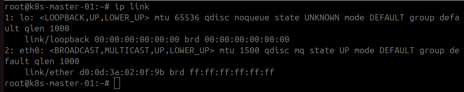

и маршрутизацию

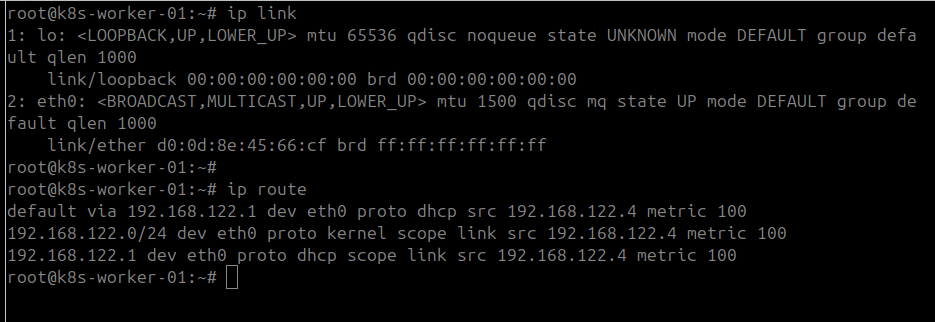

### Чеклист готовности к домашнему заданию

1. Кластер K8s с установленным сетевым плагином Calico.

Установка оператора Calico:
```
kubectl create -f https://raw.githubusercontent.com/projectcalico/calico/v3.28.0/manifests/tigera-operator.yaml
```
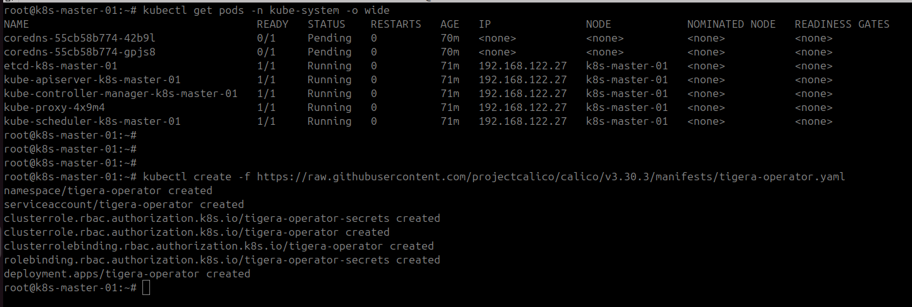

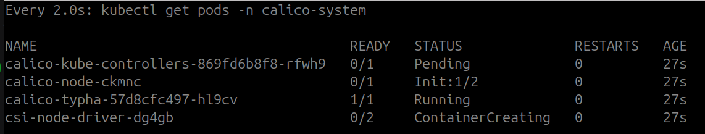

Политики созданы.


### Задание 1. Создать сетевую политику или несколько политик для обеспечения доступа

1. Создать deployment'ы приложений frontend, backend и cache и соответсвующие сервисы.

[text](homework-dz10.yaml)

2. В качестве образа использовать network-multitool.

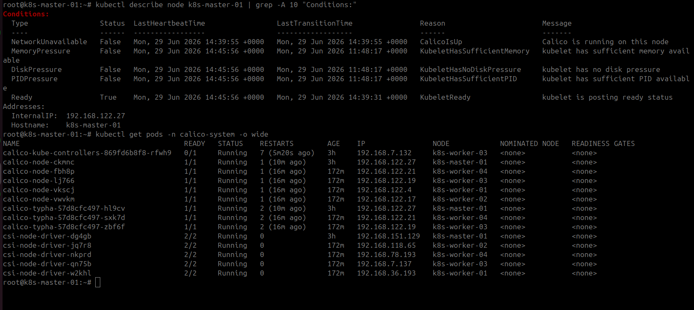

3. Разместить поды в namespace App.

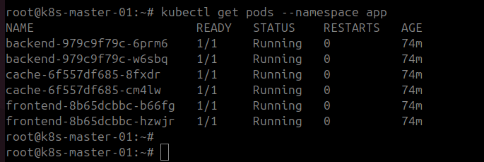

4. Создать политики, чтобы обеспечить доступ frontend -> backend -> cache. Другие виды подключений должны быть запрещены.

Структура манифеста:
- Namespace `app`
- Deployment `frontend` (2 реплики) + Service
- Deployment `backend` (2 реплики) + Service  
- Deployment `cache` (2 реплики) + Service
- NetworkPolicy для контроля трафика


5. Продемонстрировать, что трафик разрешён и запрещён.

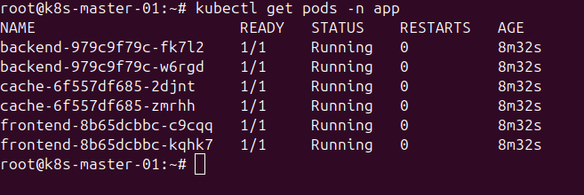

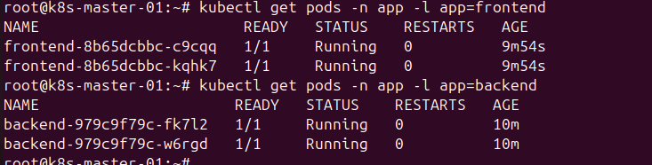

Траблшутинг, 53 порт блокируется

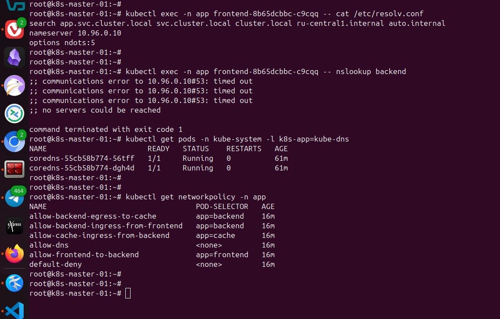

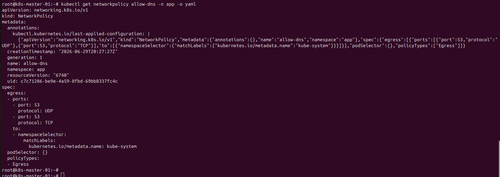

Метка есть
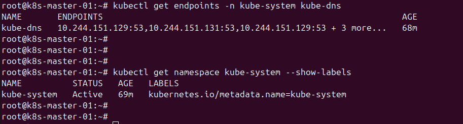

Проверяем фаерволы
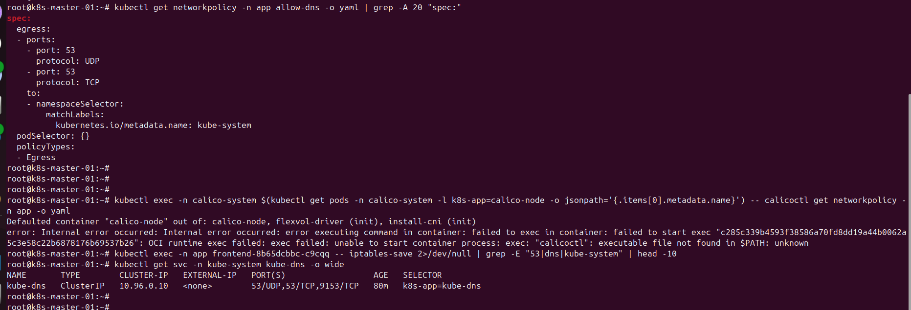

Network Policy работают
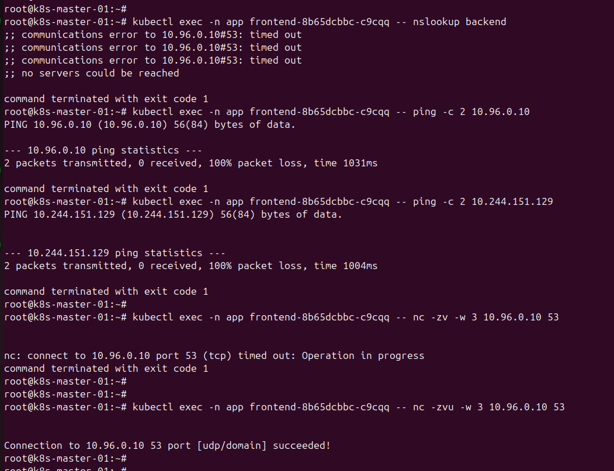

UDP трафик проходит TCP и  ICMP ping непроходят

Проверяем сетевую связанность между worker и master

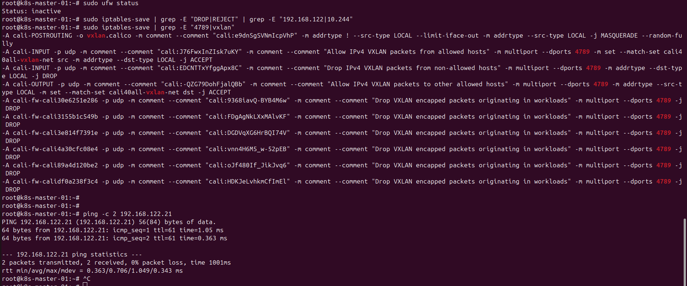

 Calico блокирует VXLAN трафик (порт 4789 UDP) правилом:
ipset cali40all-vxlan-net — если воркеры не добавлены в этот набор, VXLAN пакеты DROPаются.

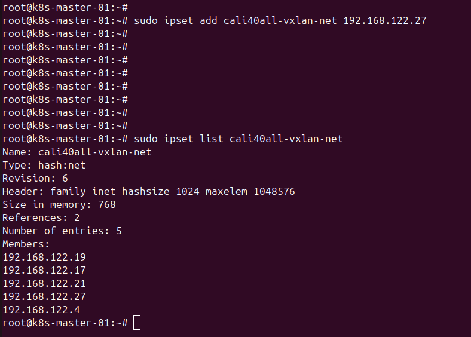

Фиксим
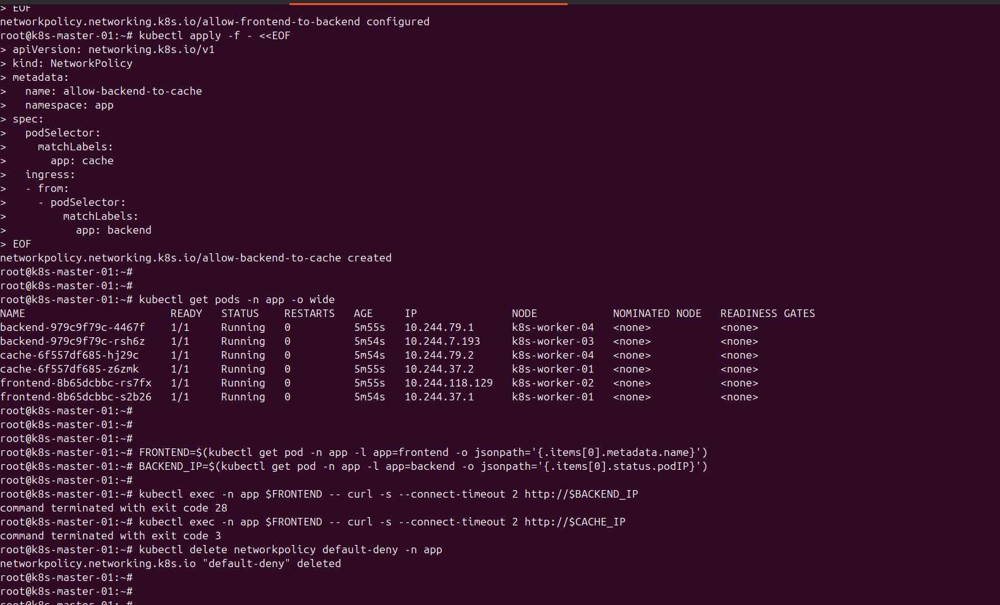

Проверяем
```
FRONTEND=$(kubectl get pod -n app -l app=frontend -o jsonpath='{.items[0].metadata.name}')
BACKEND=$(kubectl get pod -n app -l app=backend -o jsonpath='{.items[0].metadata.name}')

echo "frontend -> backend (разрешено)"
kubectl exec -n app "$FRONTEND" -- curl -m 3 http://backend

echo
echo "backend -> cache (разрешено)"
kubectl exec -n app "$BACKEND" -- curl -m 3 http://cache

echo
echo "frontend -> cache (запрещено)"
kubectl exec -n app "$FRONTEND" -- curl -m 3 http://cache

```

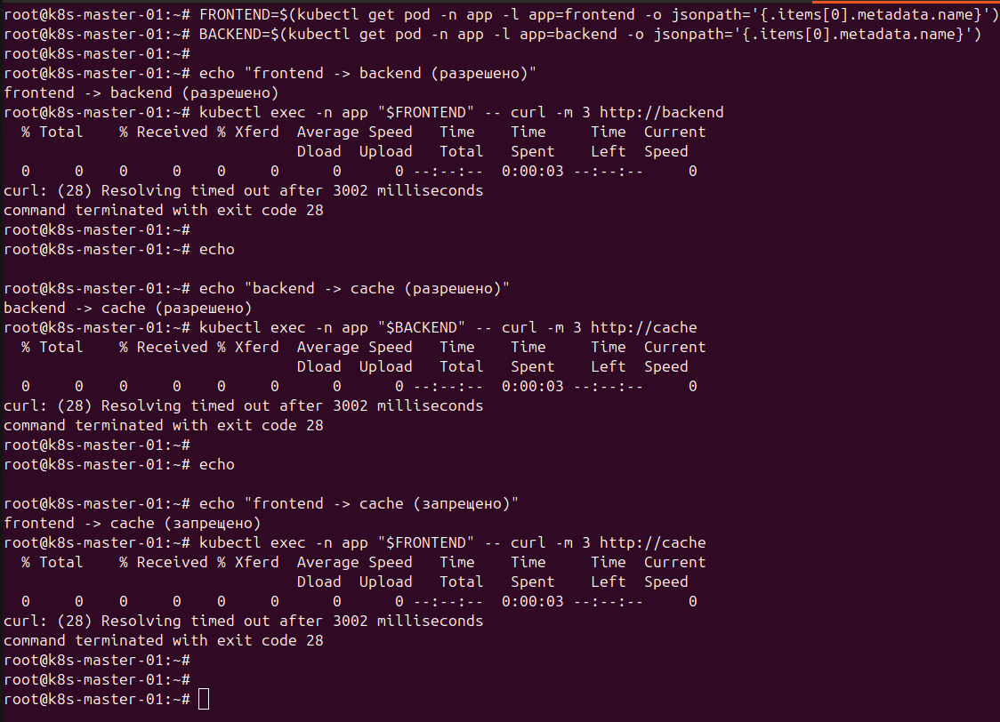


Тестирование
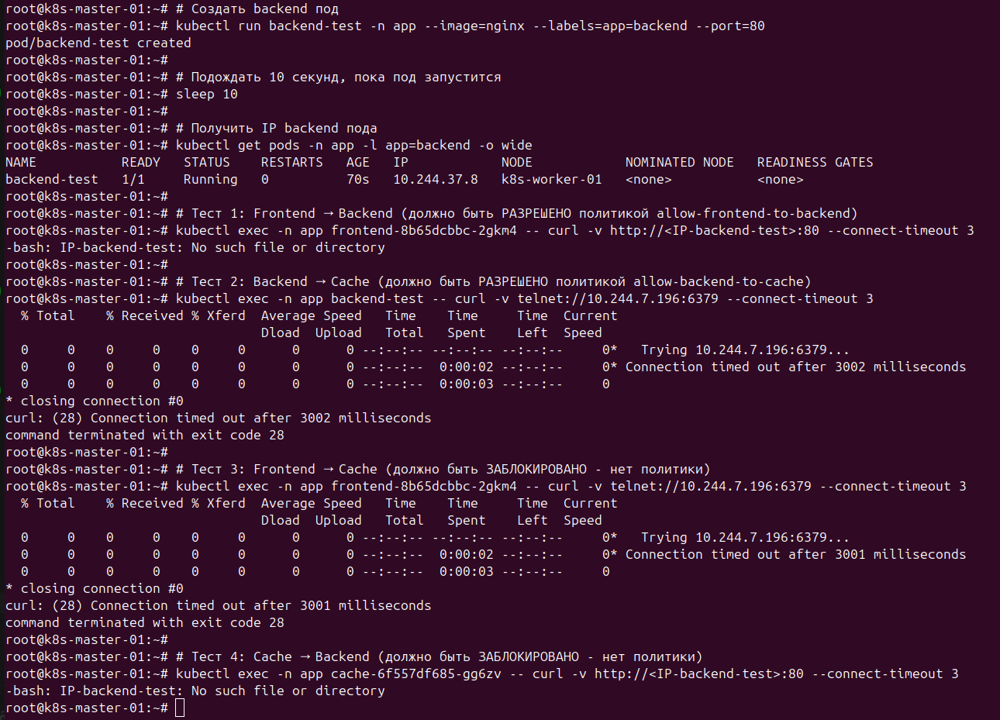

Каждому серверу выделена своя подсеть:
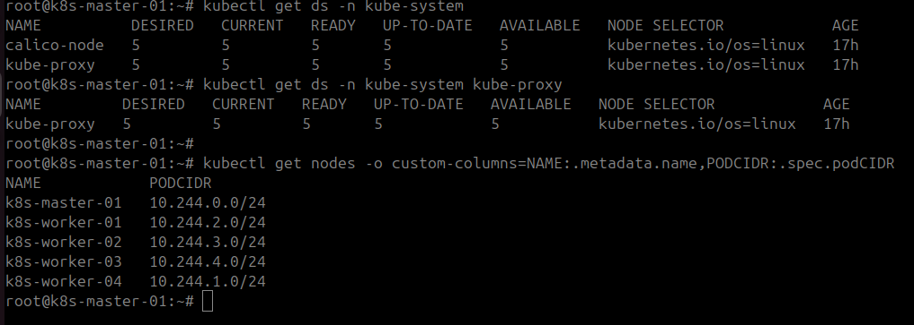

Сервисная сеть:
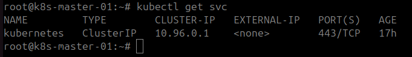

Тестирование:
 frontend -> backend разрешен
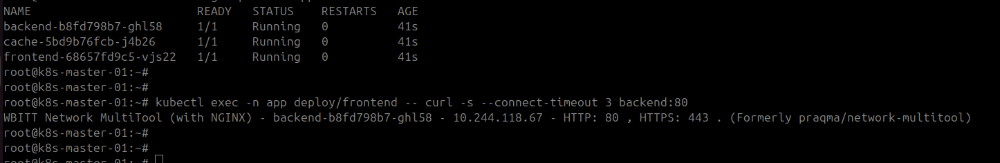

Добавим блокировку и снимем ее после теста: [text](block-frontend-egress.yaml)

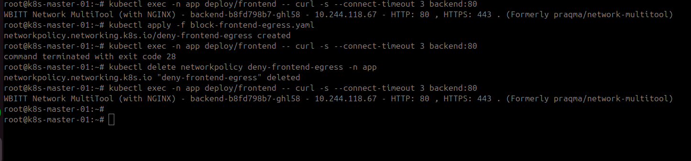

давай для backend → cache и frontend → cache) аналогично: 

 frontend -> cache запрещен
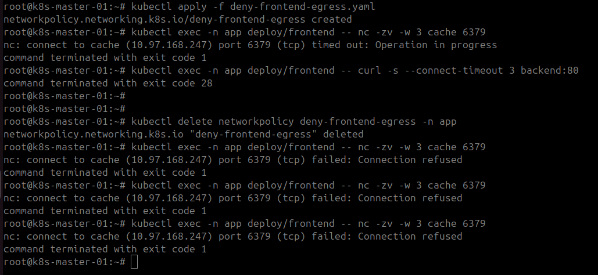

 backend -> cache разрешён

backend -> cache трафик разрешён – проверяем
kubectl exec -n app deploy/backend -- nc -zv -w 3 cache 6379

Ожидаем: Connection refused

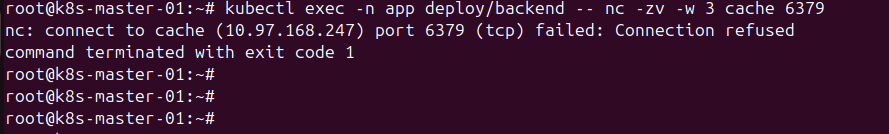

backend -> cache включаем блокировку egress для backend
kubectl apply -f deny-backend-egress.yaml

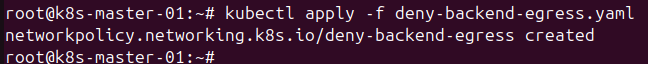

backend -> cache  проверяем – трафик заблокирован (таймаут)
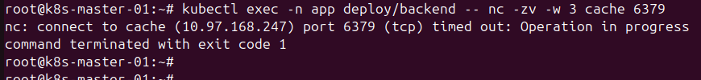


backend -> cache  Откатываем
kubectl delete networkpolicy deny-backend-egress -n app

и сразу

backend -> cache проверяем что трафик снова доходит (Connection refused)
kubectl exec -n app deploy/backend -- nc -zv -w 3 cache 6379

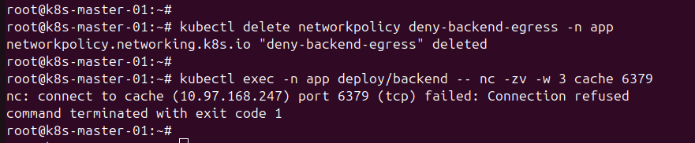

Применяем полный конфиг политик

[text](networkpolicy.yaml)


Что включено в этот конфиг:
Политика	                Назначение
allow-icmp	                Пинг между всеми подами и namespace'ами (для проверки базовой связности)
allow-dns-egress	        Исходящие DNS-запросы в kube-system
allow-dns-ingress	        Ответы от DNS-сервера обратно к подам
default-deny	            Запрещает всё, что не разрешено явно
frontend-egress-backend	    frontend → backend:80
backend-ingress-frontend	backend принимает от frontend:80
backend-egress-cache	    backend → cache:6379
cache-ingress-backend	    cache принимает от backend:6379

Проверка 1   (DNS)

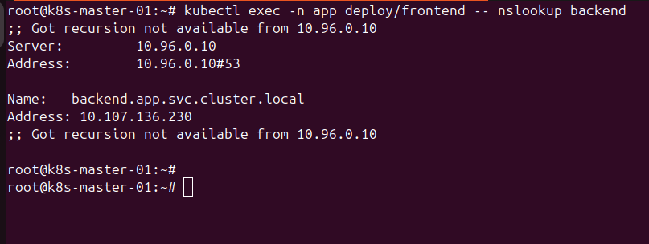

Проверка 2   (трафик: frontend -> backend)

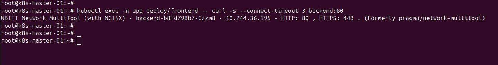

Проверка 3   (трафик: backend → cache)

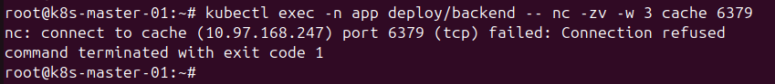
* трафик дошел и был refused 

Проверка 4   (Запрещённый трафик: frontend -> cache)

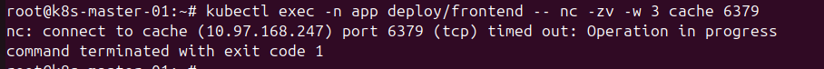
* виден тайм-out

Проверка 5   (Запрещённый трафик: backend -> frontend)
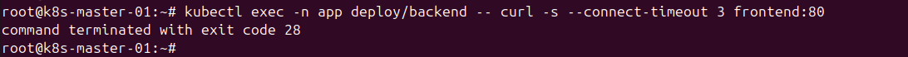
* блокировка

Проверка 6   (Запрещённый трафик: cache -> Any where)

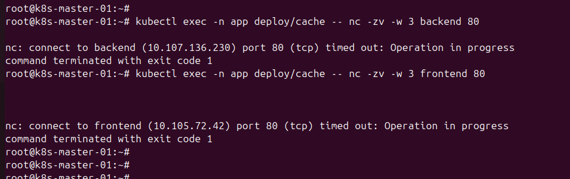


Проверка 7   (Запрещаем и разрешаем в политике, применяем)

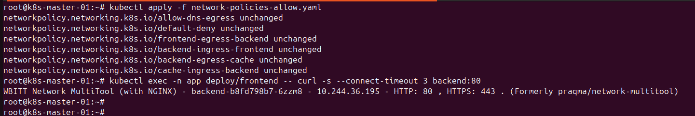

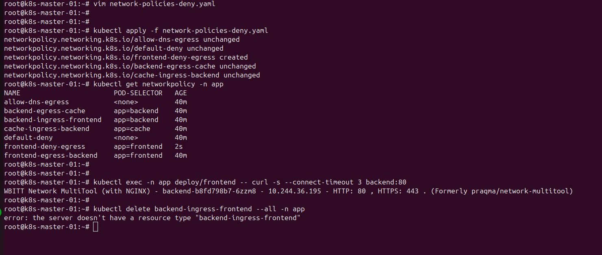
** при наложении запрещающей и разрешающей полити в кубере приоритет имеет та политика, которая разрешающая

Удаляем разрешающие политики и получаем блок
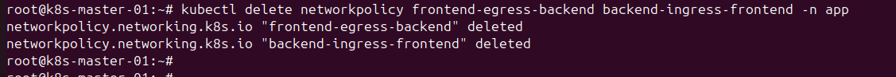

Возвращаем обратно в исхоное положение:

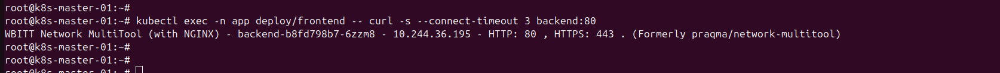


:-)  Соррян что задержался...

### Инструменты и дополнительные материалы, которые пригодятся для выполнения задания

1. [Документация Calico](https://www.tigera.io/project-calico/).
2. [Network Policy](https://kubernetes.io/docs/concepts/services-networking/network-policies/).
3. [About Network Policy](https://docs.projectcalico.org/about/about-network-policy).

-----